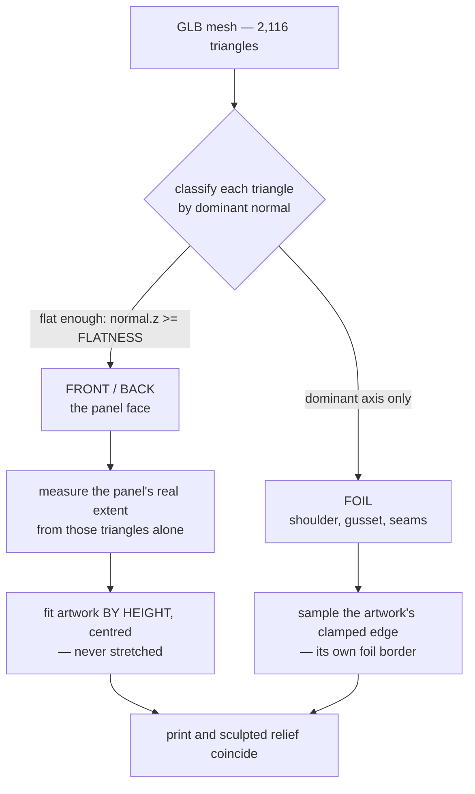

# Meridian

A Hebrew, right-to-left pre-launch page for a fictional specialty coffee brand. The product is a
1 kg bag of beans, and it is the page's only real UI element: a 2,116-triangle model that turns
through three beats of copy as you scroll, showing you the front label, then the flavour notes,
then the back of the pack.

Built to a written spec — 61 acceptance criteria, 15 retired ones kept as tombstones — because the
point of the exercise was to find out whether a spec chain survives contact with a real design.

```
npm install
npm run dev          # http://localhost:3000
```

Hebrew only. There is no language toggle, no CMS, no account, no database, and nothing is stored
about anyone who uses it.

---

## The artwork is registered to the mesh, not stuck on it

The model came from Tripo. Its geometry is a genuinely good crumpled box-bottom pouch; its baked
texture is a hallucination — `MERII SPECIA`, `JASNINE BLUERE`, invented body copy scattered across
a fragmented atlas. So the geometry was kept and the texture thrown away.

The real label is two flat panels, drawn in CSS and inline SVG at `art/panel-front.html` and
`art/panel-back.html`, screenshotted to `public/art/`, and projected onto the mesh at load. The
projection is what makes it look printed rather than decaled:



Two rules do the work, and both are measured off the mesh rather than assumed. The panel's extent
comes only from triangles that are actually flat, so the artwork registers to the face and not to
the whole silhouette. Material assignment is looser — dominant axis — so the print **wraps the
shoulder** the way real packaging does, sampling the artwork's clamped edge, which is its own
foil-coloured border. Each panel is fitted by height and centred, so neither is ever stretched.

The result is that the sculpted creases in the mesh fall across printed type, which is the thing
that stops it reading as a sticker.

The source model was 58 MB. What ships is **79 KB**:

| Stage | Size | Triangles |
| --- | ---: | ---: |
| Tripo export | 58.3 MB | 1,897,457 |
| Welded and simplified | 9.1 MB | 94,862 |
| Decimated, stripped, shipped — `public/models/meridian-pack.glb` | **79 KB** | 2,116 |

## One breakpoint, two consumers

The copy layout and the 3D camera have to agree about whether there is room for a column beside the
pack. They did not: the copy switched on **width** (`64rem`) and the camera on **aspect ratio**
(`< 1.15`), and those disagree in a band. A 1024×900 window or a 1280×1200 display got the wide
two-column copy with the narrow, centred, pulled-back camera — so the headline landed on top of the
product with the body text running across it.

Both now read one signal, `matchMedia("(min-width: 64rem)")`, which makes the failure unreachable
rather than fixed. Verified at 320, 360, 390, 430, 768, 1024×768, 1024×900, 1280×1200 and 1440: no
overlap, no horizontal overflow, exactly one beat lit at each scroll stop.

## Accessibility

Lighthouse mobile scores **100** for accessibility with **no failing audits**, measured on the
production build. That is the floor rather than the claim — automated tooling covers roughly a
third of WCAG, and `/accessibility` says so in Hebrew alongside the three known gaps, including
that no screen-reader pass has been done.

Contrast is computed from the design tokens and recorded beside them in `app/globals.css`:

```
muted     on surface  12.05:1   body copy in the beats
gold      on surface   8.40:1   kickers, figures, the buy button
faint     on surface   4.54:1   footer blurb, consent note
```

The accessibility menu — text size, high contrast, link highlighting, a readable font, stopped
motion, enlarged cursor — is **built, not installed**. The usual route in Israel is a third-party
overlay script; those rewrite the DOM and patch ARIA at runtime, and routinely make things worse
for the screen-reader users they claim to serve. This is ordinary CSS switched by data attributes
on the root element, so it never touches the accessibility tree and cannot fight assistive
technology. Stopping motion also halts the WebGL camera, which no stylesheet can reach.

It is not offered as compliance with anything. Regulations 5773-2013 reg. 35 requires the
**statement**, which is at `/accessibility`; the menu says as much to the visitor in its own
footnote.

RTL correctness is enforced rather than reviewed. `npm run check:logical` fails on any physical
directional CSS in `app/`, `components/` or `lib/`:

```
$ node scripts/check-logical.mjs
AC-007 ok — no physical directional values in app/, components/ or lib/
```

## Run it

```bash
npm install
npm run dev              # development
npm run verify           # lint + production build — the gate
npm run check:logical    # RTL guard
```

To serve the production build, note that `next start` **does not work here**: `next.config.ts` sets
`output: "standalone"`, which builds its own server.

```bash
npm run build
cp -r .next/static .next/standalone/.next/
cp -r public .next/standalone/
npm start                # runs node .next/standalone/server.js
```

Those two `cp` lines are not optional — `standalone` deliberately omits static assets and `public/`,
and without them the page serves with no CSS and no poster, which looks like a different bug
entirely. The Dockerfile does the same two copies. **Stop that server before rebuilding:** it holds
`.next/standalone` open, and on Windows the next build blocks on the locked directory without
saying why.

Regenerating assets needs Chrome on `PATH`, or `CHROME=` pointing at it:

| Command | Produces |
| --- | --- |
| `node scripts/panels.mjs` | `public/art/panel-{front,back}.webp` — the flat label artwork |
| `node scripts/pack-model.mjs` | `public/models/meridian-pack.glb` — decimate and strip the source |
| `node scripts/poster.mjs` | `public/art/pack-poster-{wide,narrow}.{avif,webp,png}` — first-paint frames |

`poster.mjs` drives the real page and reads its canvas back, rather than rebuilding the studio in a
standalone scene that would drift the first time a light moved.

## Under the hood — briefly

- **7 runtime dependencies.** Next 15, React 19, three.js and its two React bindings, Framer Motion.
  No UI kit, no state library, no form library, no analytics SDK.
- **The canvas is not in the first paint.** An AVIF poster of the same frame, lit the same way,
  cross-fades to the live render once the WebGL chunk arrives on idle. `/` is 154 kB of First Load
  JS, with the three.js chunk outside it.
- **Images are art-directed, not resized.** Two poster frames, one per breakpoint, in AVIF, WebP and
  PNG. The wide frame is 210 KB as a PNG and **9 KB as AVIF** — a soft-lit render on a transparent
  ground is close to the worst case for PNG.
- **The pack textures are lossless WebP**, 181 KB down to 90 KB. Lossless because the type on them
  is a few pixels tall in the file and then magnified onto the label, where ringing around a glyph
  edge would arrive at the size a visitor reads it.
- **The form posts to `/api/subscribe`, which validates an address and discards it.** No sender, no
  storage, no third party. It rate-limits and screens a honeypot regardless, because the endpoint is
  real even though the brand is not.
- **No cookies.** One `localStorage` key, holding the accessibility preferences a visitor chose.

## What this deliberately is not

It is a portfolio demonstration of a brand that does not exist. Meridian is fictional; the origins,
the roast dates and the countdown are illustrative, and the footer says so. Nothing is sold, and no
address is collected.

Not done, and tracked rather than hidden: the Hebrew has not been read by a native speaker, the
legal pages have not been reviewed by anyone qualified, and two asset licences are unconfirmed. See
`CREDITS.md` and `deploy/README.md`.

## Layout

```
app/            routes — one page, two legal pages, two API routes
components/     a11y · brand · layout · motion · nav · scrolly · sections · three
content/        every Hebrew string, one module, one type
lib/            projection, scroll choreography, validation, rate limit, a11y prefs
art/            the label artwork as HTML, and how it was registered to the mesh
scripts/        asset pipeline — panels, model, posters, and the RTL guard
docs/           CONSTITUTION.md, changes/, refactorings/, legal/
deploy/         nginx example and the deployment notes
SPEC.md         the spec the whole thing was built against
```

`SPEC.md` is the interesting file. It carries the acceptance criteria, the decision record behind
each choice, and tombstones for everything that was tried and retired.
